# Pastry Bites: University Senior Project

## Quick Links
- [Introduction](#introduction)
- [The Team](#the-team)
- [Features](#features)
- [Technologies](#technologies)
- [Testing](#testing)
- [Deployment](#deployment)
- [The Order Process (With Images)](#the-order-process-with-images)
  - [Home page](#home-page), [Product Page](#product-page), [Cart Page](#cart-page), [Shipping Address Page](#shipping-address-page), [Proceed To Stripe Page](#proceed-to-stripe-page), [Stripe Payment Page](#stripe-payment-page), [Order Page](#order-page)
- [Reporting Tools (With Images)](#report-tools-with-images)
  - [Charts](#charts), [Tables](#tables), [Export Data](#export-data), [API Status](#api-status)
- [Authentication Pages (With Images)](#authentication-pages-with-images)
  - [Signup Page](#signup-page), [Login Page](#login-page), [Change Password](#change-password), [Manage Email Addresses](#manage-email-addresses)
- [More Pages (With Images)](#more-pages-with-images)
  - [Profile Page](#profile-page), [Contact Page](#contact-page), [Blog Pages](#blog-pages)

## Introduction
- California State University, Sacramento CSC [190](https://catalog.csus.edu/search/?P=CSC%20190)-[191](https://catalog.csus.edu/search/?P=CSC%20191) Senior Project.
- I and 7 team members created a website for our client, an individual who is interested in a website that will help her manage orders she receives. 
- Prior to the website's creation, Cigdem managed orders and customer data using Excel, a process that was both time-consuming and error-prone. 
- Our website now streamlines these tasks by providing real-time order notifications, efficient tracking, secure payments, and data analysis through charts and graphs.
- **Please note**: The repo that this project is [forked from](https://github.com/CSC190SeniorProject/SeniorProject) is used by our client. After the course concluded, I made some changes to allow for the demonstration of the site to employers. 

## The Team
- [Muhammad Ahmed](https://github.com/mahmed5499)
- [Jordan Huang](https://github.com/jordanhuang916)
- [Nathan Martinez](https://github.com/nathandevx)
- [Tiffany Nguyen](https://github.com/tiffanypnguyen)
- [Jainish Patel](https://github.com/jainish123-pixel)
- [Rahil Patel](https://github.com/rahilpatel29)
- [Moises Vaca](https://github.com/B1ueF10WER)
- [Lovedeep Vasisht](https://github.com/LovedeepVasisht)

## Features
- Customers can create an account, add products to their cart, and checkout securely via the Stripe API.
- Admins are able to view charts showing how many orders have been made in a given year, they can view tables showing all the products they've created, and they can export order data for tax purposes.
- **User authentication**: Users can register and login to the website. 
- **User authorization**: We created three user groups to manage access to different sections of the website: visitors, logged in users, and admins. Each group has different levels of access and permissions:
   - **Visitors**: They can view the website, but they're not able to place orders.
   - **Logged-in Users**: In addition to what visitors can do, logged-in users can place and pay for orders, view their order history, and manage their account settings.
   - **Admins**: In addition to what logged in users can do, admins can manage orders, generate reports, and export data for further analysis.
   - **Superuser**: In addition to what admins can do, superusers can manage all users.

## Technologies
- **Python**: The programming language used to build the backend functionality of the website.
- **Django**: The web framework that provides the tools for creating websites in Python.
- **JavaScript**: Adds extra interactivity and client side activity (asynchronous calls) to the website.
- **Bootstrap**: For creating responsive and modern UIs.
- **HTML/CSS**: For structuring and styling the website.
- **Stripe**: For handling payments securely and maintaining [PCI Compliance](https://stripe.com/guides/pci-compliance).
- **AWS S3**: For handling uploaded media (such as product images). 
- **Heroku PostgreSQL**: For hosting the database.
- **Heroku**: For hosting the website.

## Testing
- We used Django's builtin tester for unit and integration tests.
- We tested functionality such as shopping cart creation, checkout functionality, ensuring emails are sent, and ensuring that pages display the correct information.

## Deployment
- We used Heroku to host the web application and Heroku PostgresSQL to host the database. 

## The Order Process (With Images)
- This section outlines the user's journey from the homepage to completing an order payment.

### Home Page
- Shows the products available for purchase.
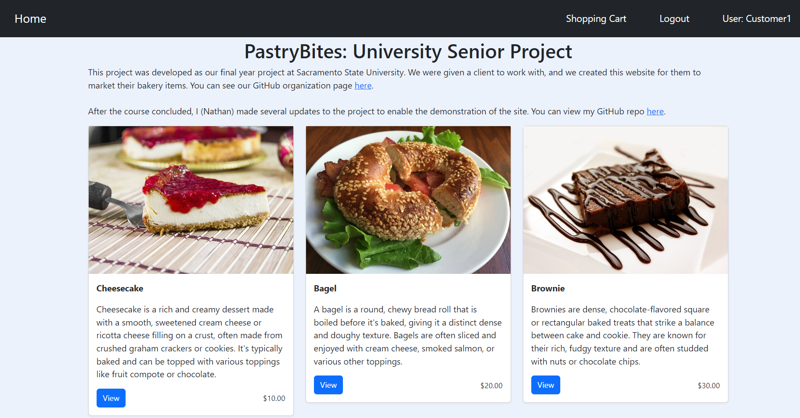

### Product Page
- Shows details about the product and allows the user to add it to their cart.
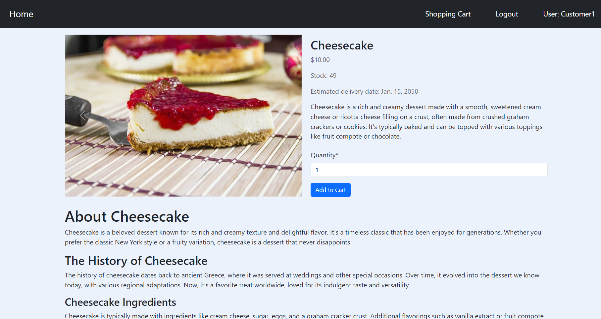

### Cart Page
- The user's shopping cart. They can add or remove products from their cart, they can empty their cart, or they can checkout.
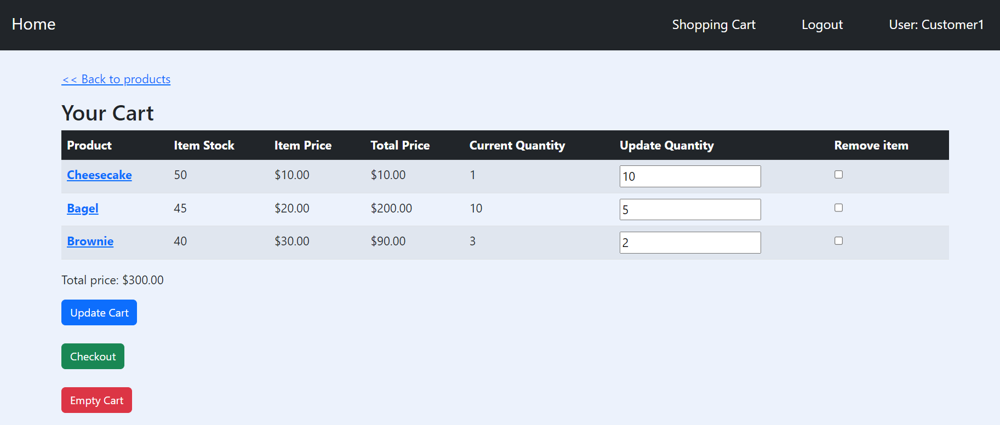

### Shipping Address Page
- When a user clicks "checkout" on their cart page, they are redirected to this page to enter their shipping address.
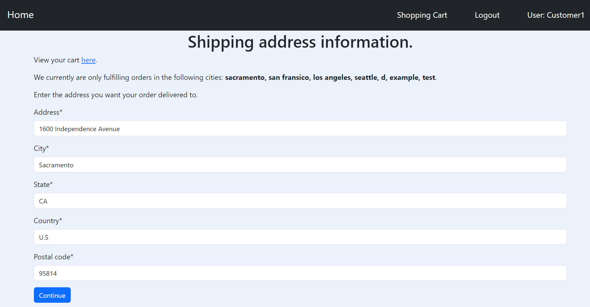

### Proceed To Stripe Page
- When a user clicks "continue" on the shipping address page, they are redirected to this page. From here they can click continue to pay for their order.
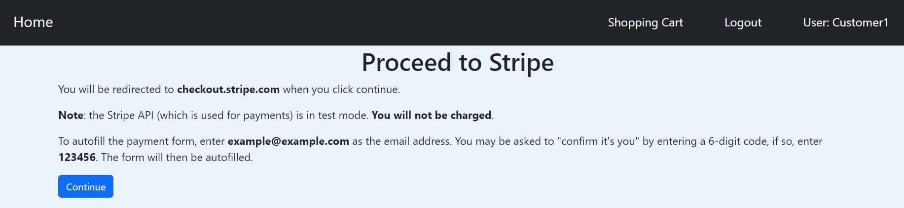

### Stripe Payment Page
- When the user clicks "continue" on the proceed to stripe page, they are redirected to this page. This is where the user securing pays for their order.
- We're using the Stripe API and it's in test mode for this project. So you can just enter example@example.com for the email address and it will fill the payment form with dummy info. 
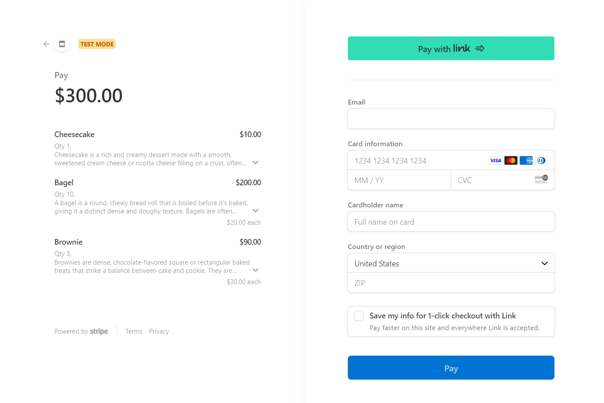

### Order page
- When the user's payment successfully processes, they are redirected to this page and receive an order confirmation email showing them what they ordered.
- This page shows the user what they ordered, an estimated date of delivery, the total price of their order, and more.
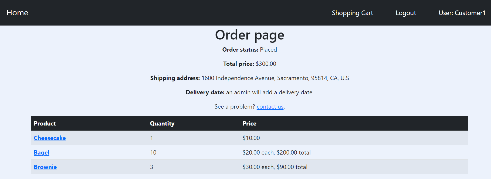

## Report tools (With Images)
- These pages are only accessible by admins.
- We built several reporting tools to help our client manage the orders. Such as charts, tables, and the ability to export data.

### Charts
- The "User Plot" shows how many users signed up in the selected year.
- The "Order Plot" shows how many orders were made in the selected year.
- The "Order Status Chart" is a pie chart of all the orders that have been made on the site and what their status is (Shipped, Canceled, etc).
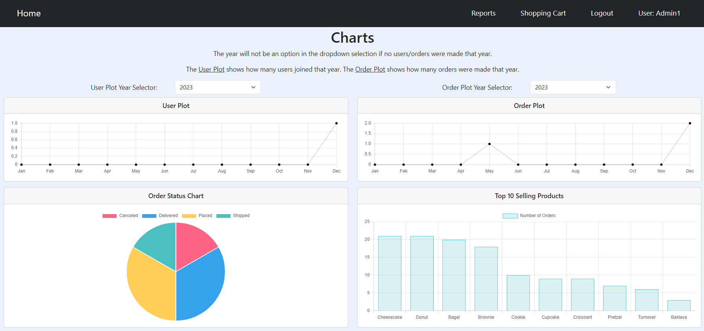

### Tables
- The blue table headings indicate that the table is sortable by clicking it. For example, on the "Orders" table if you click on "Total Price" the table will sort by lowest to highest total price.
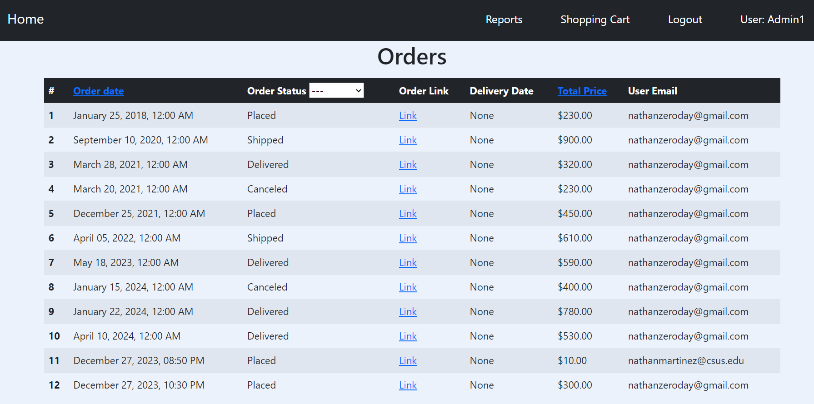
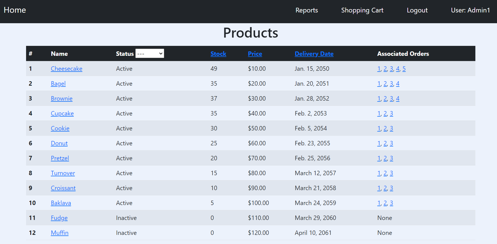
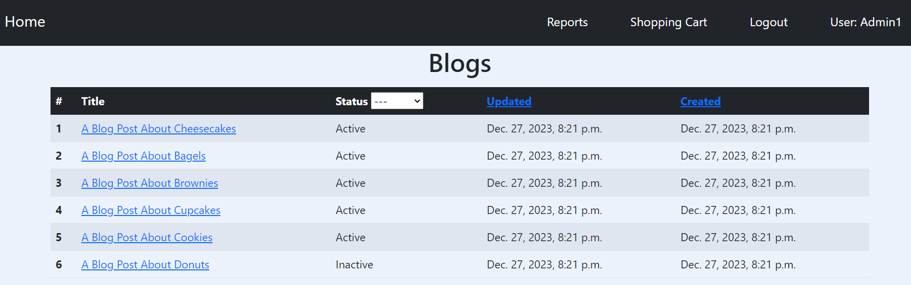

### Export Data
- This page allows the admin to export order data from the site. It downloads a file called "report.tsv" which contains order date, total price, user email, etc for each order ever made.
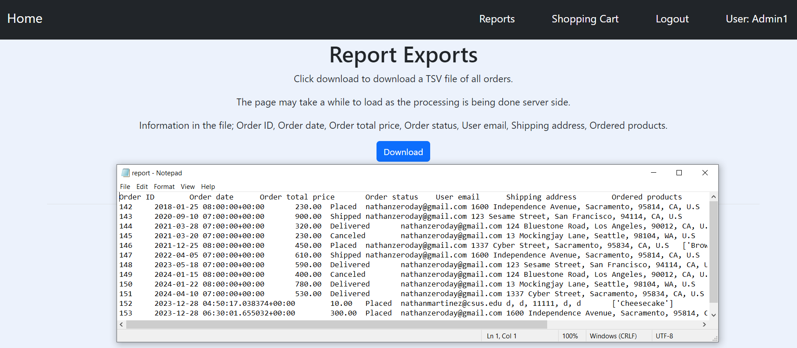

### API Status
- This page allows the admin to see at a glance which APIs are operational.
- As a reminder, we're using AWS S3 to handle image uploads, Stripe to handle payments, and SendGrid to send emails. 
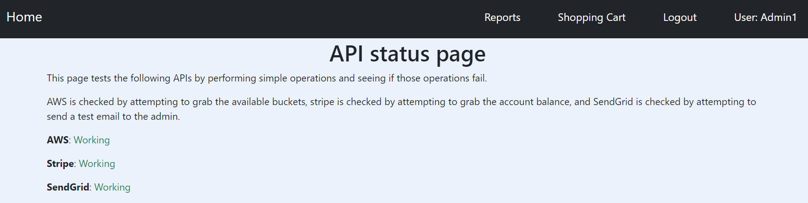

## Authentication Pages (With Images)
- This section shows common authentication related pages such as the login page, signup page, etc.

### Signup Page
- This page allows the user to create an account.

### Login Page
- This repository is for demonstration purposes. The repository that this project is forked from is used by our client. Which is why there is an option to click a button and be logged in as an administrator.
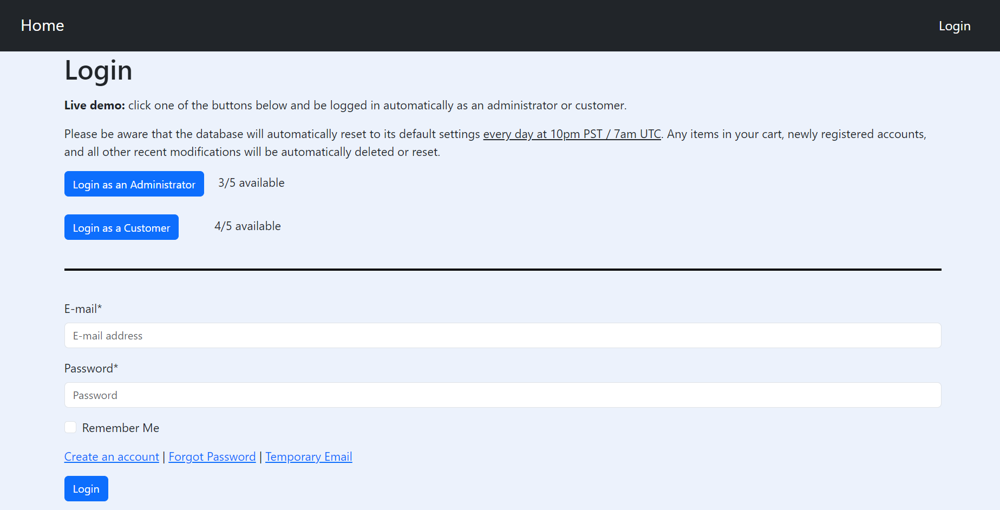

### Change Password
- ...
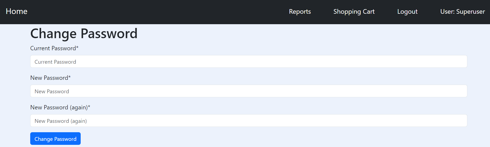

### Manage email addresses
- ...
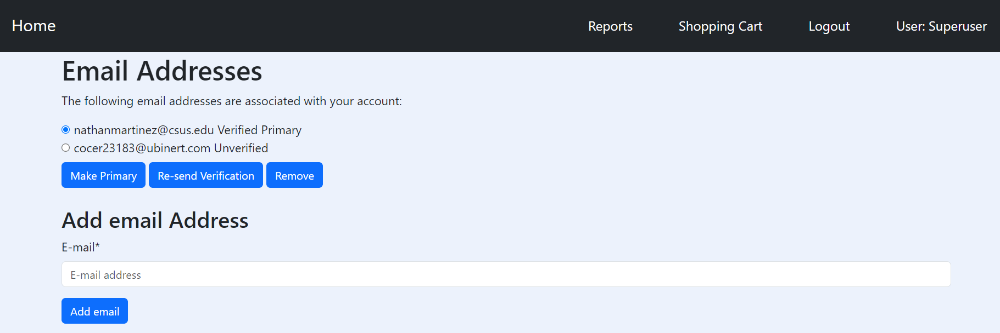

## More Pages (With Images)
- More pages from the project.

### Profile Page
- The following links are not available for demo accounts; delete account, change password, and manage your email addresses.
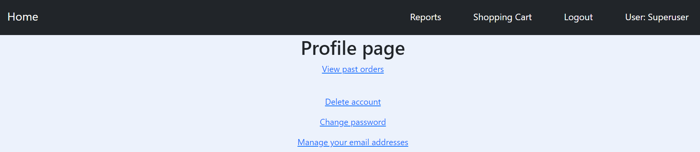

### Contact Page
- When the user clicks submit, it a message will be sent to the admin with the entered email address, subject, and message.
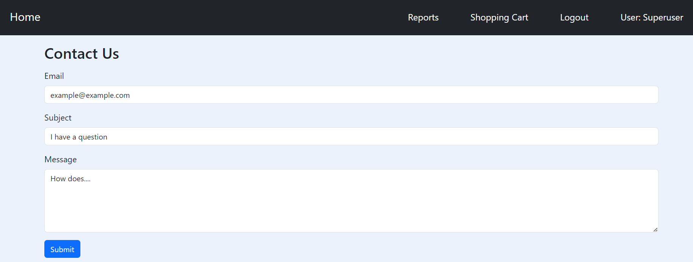

### Blog Pages
- There's also a blog.
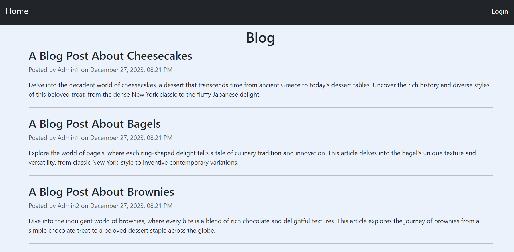
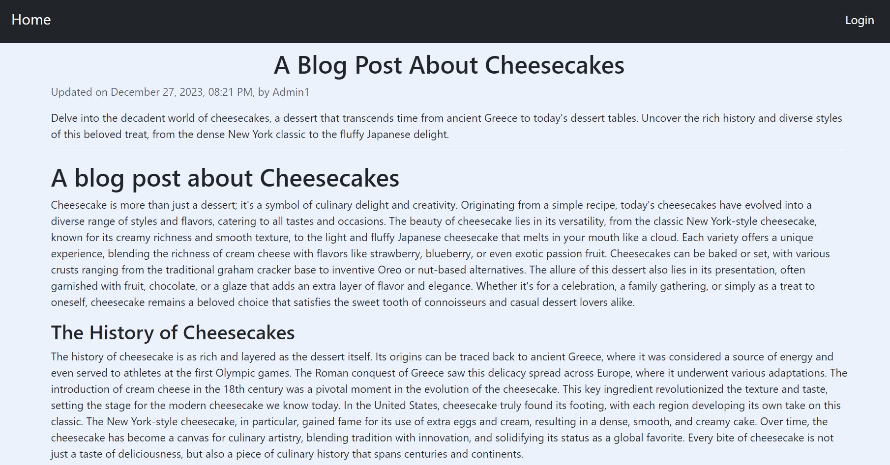
